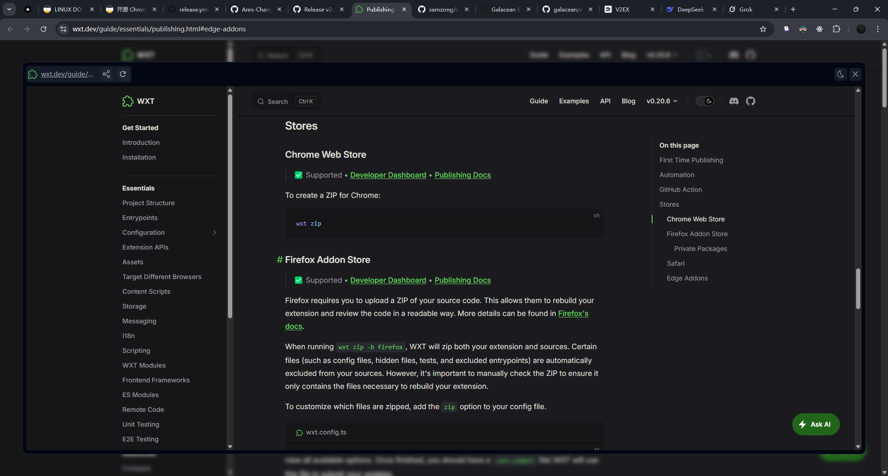

# Quick View

链接内容一瞥即知。

即用即走，不占用任何窗口。

## 产品简介

Quick View 是一款专为高效浏览设计的浏览器插件，让您无需离开当前页面，即可快速预览链接内容。
只需简单的拖动或快捷键点击，链接内容便会通过弹窗即时呈现在您眼前，无需新开浏览器标签页。
我们的设计理念是“链接内容一瞥即知。即用即走，不占用任何窗口”，确保您的界面始终整洁，专注当前任务。

无论是浏览新闻、社交媒体，还是进行在线研究，Quick View 都能为您节省时间，提升效率。
无需繁琐的页面跳转，您可以轻松获取信息后关闭弹窗，继续手头的工作。
Quick View 将浏览体验化繁为简，让信息获取更加流畅便捷。

## 为什么选择 Quick View？

- 高效便捷：在当前页面快速预览链接，节省跳转时间。
- 界面整洁：不占用额外的标签页或窗口，保持浏览专注。
- 即用即走：获取信息后一键关闭，流程无缝衔接。
- 广泛适用：适合新闻阅读、社交互动、研究查阅等多种场景。

> **Quick View —— 让您的浏览更高效，让链接内容触手可及！**
